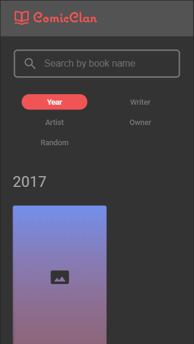

# ComicClan WebApp
* [Commands](#commands)
* [Project Structure](#project-structure)
    * [assets](#assets)
    * [components](#components)
        * [BookCard](#bookcard)
        * [Header](#header)
    * [pages](#pages)
        * [MainPage](#mainpage)
            * [BookContainer](#bookcontainer)
            * [SearchBar](#searchbar)
            * [SearchForBooks](#searchforbooks)
            * [TypeSearch](#typesearch)
        * [BookPage](#bookpage)
    * [services](#services)
    * [store](#store)
    * [utils](#utils)
    * [Root files](#root-files)
* [Roadmap](#roadmap)
 ## Commands
Just 3 commands that I used on the project: 
* Start
```
npm start or yarn start
```
That command runs with react script, and open as a dev react

* Build
```
npm run build or yarn build
```
That will build the project and will be putted on the build folder

* Server
```
npm run server or yarn server
```
That will run the server, in the case, put the build on production. My propose is test the build.

## Project structure

By the start of a React project, I removed all the initial things that I didn't need, like service work, css, etc. on the public folder I just keep with the index.html, edited the index, just keeping the necessary, changing the icon and the title. In the index.html, I putted the Roboto font as well.

Now in src folder, there is 6 folders:

### assets 
Just have images, the icons is inside the icons folder and in the images have the logo.

### components
I have to mention the pages folder, because there is global components and page component. In the components folder, there is the global components, those components is used in the Main and Book page. There is 2 major components:

#### BookCard
Basically is where parse all the book data, see above the BookCard.
<br />


#### Header
The header is site logo, see bellow.
<br />

<br />

There is another component, but he is just to put the page on top on change route.

### pages
The total pages is 2: MainPage and the BookPage. To redirect one to another, in the MainPage you have to click in some BookCard and open the book datails. In the BookPage, click in 'back to collection' or in the logo, to return to MainPage.

#### MainPage
In the MainPage has 4 components, that mounts the page.

##### BookContainer
This is where all the books is parsed to a list that user prefers, year, writer, artist, owner or random. All those are sorted on the array that has the chosen set, but in the random is sorted 20 numbers between 0 and the length of all books. See the image bellow with an example.
<br />

<br />

##### SearchBar
The user types anything here hit enter,and the api will be called with "?q='what-user-searched'" in the end.
<br />

<br /><br />

An additional thing, the page changes with the route, if is "site/search", the main page will not have the [TypeSearch](#TypeSearch), instead will have the [SearchForBooks](#SearchForBooks)
<br />

##### SearchForBooks 
This parse the result that user searched for.
<br />

<br />

##### TypeSearch   
Where have the list with the types of search, what will be order like, see the image bellow.
<br />

<br />
See the image with all the main page:
<br />
Desktop:<br/>

<br />
Mobile: <br />

<br />
<br />

#### BookPage
There will display the book content, there is 2 components, the BookContent and the RandomBooks. See the page bellow:
<br />
Desktop: <br />

<br />
Mobile: <br />

<br />

### services
Just contain the API, the connection and the header authorization.

### store
This is where the redux comes, all the actions and reducers is there.

### utils
Have 2 files with the auxiliar functions. The ArrayUtils can order a array, ascending or descending order, and merge the array. GenerateNumbers, that generates an array of random numbers, and unique numbers.

### Root files
On the App.js, will load all the data and store on the redux.
The global-styles.js have some components that used in many files, and of course the css reset and the main style.

## Roadmap
First the css reset, next the header, search field, type of search, etc. in the layout I didn't have any issue, at the beginning of course, my first problem was to parse all data, so I picked up all data with insomnia and work locally, without API calls. There was a tiny problem, the duplicated itens inside arrays, and with that I search for a function to parse all that data with non duplicates.
After finished the layout, the next step was the API calls, there was some problem with the initial structure, and adapted all to receive that data.
Redux it was the next, my ideia was to store the typesearch to handle with it better and the books, so the API just call once and pass through all app.
And then started to work with responsivity, that was easy, just openned up the chrome console and putting this like a smartphone. 
At last, my problem was iPhone, there was a weird problem, some components was overlaping another components, so I come to google, and start to make a research about this, hours of research, and I found out what was the problem, and solve him, was the height.